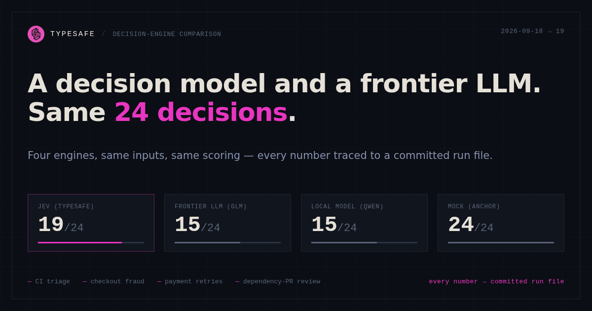

# typesafe-lab



> **Learning project, not a benchmark.** This repo exists for learning and
> informative purposes only. Everything here was produced by one person on a
> hobby scaffold with small sample sizes (24 decisions, 12-case flows, N=5
> probes) — treat every number as anecdote, not evidence. Nothing here is
> endorsed, reviewed, or affiliated with TypeSafe AI in any way. Validate all
> information yourself against primary sources and your own experiments before
> relying on it.

A learning scaffold for [TypeSafe AI](https://typesafe.ai/)'s **System One
models** — a new class of AI model that returns typed, calibrated decisions
instead of generated text. The first System One model is **Jev** (early access
via waitlist).

**Live demo**: the full measured comparison as an interactive page —
**[jev-access-day.vercel.app](https://jev-access-day.vercel.app/)**

This project is the instrument, not the experiment: it taught the paradigm
against a mock and an LLM stand-in, then became the eval harness that measured
the real Jev in a live comparison day (2026-09-18). All measured numbers below
come from the committed waves in `results/` (`2026-09-18/`,
`2026-09-18-postfix/`, `2026-09-18-access-day/`) — claimed vs measured, per
claim, in `results/2026-09-18-access-day/claims.md`.

## The mental model

Jev is not a chatbot and not an agent. It is a **function call your code
invokes for semantic judgment**:

```
state (any JSON)  +  atomic questions (noul / choice / score)
        →  one POST /v1/systemone  →  typed answers with probabilities
        →  plain if-statements and confidence gates in YOUR code decide actions
```

- You never chat. There is no conversation, no prose, no explanations in the
  output — decisions and probability distributions only.
- Every question is a **gut-check** a knowledgeable person could make in
  seconds: "does this convey urgency?", not "analyze and decide".
- All questions in one call are evaluated **in parallel and independently**;
  adding questions barely changes latency. Batch aggressively.
- **Code owns the control flow**: thresholds, retries, side effects, and the
  question set are all yours. Change the model's behavior by editing
  questions, not by prompting.
- Confidence is the second decision axis: high → act, mid → step-up/verify,
  low → escalate to a human.

This lab implements that shape across four domains — one architecture, four
decision patterns:

| Domain | Question fan-out | Composition in code |
|---|---|---|
| **CI test-failure triage** (`src/triage/`) | 5 atomic questions over a Jest failure | confidence-gated routing → auto-retry / restart infra / file P1/P2 / fix test / human |
| **Checkout risk cascade** (`src/checkout/`) | 4 pre-bureau + 3 post-bureau questions | skip-or-call bureau, expected-value thresholds with asymmetric fraud/false-decline costs, 3DS step-up, analyst review |
| **Dunning retries** (`src/dunning/`) | bounce-cause, customer-standing, schedule-risk questions | temporal kernel owns WHEN: retry-in-3d / method-switch / next-schedule / pause — from fixture-data temporals, not the model |
| **Dependabot PR review** (`src/prreview/`) | attack-path, semver-triviality, runtime-touch, lockfile questions | 4-action taxonomy with model-to-model escalation (`needs_llm_review` → typed reviewer verdict, 0.6 confidence gate) |

## The four providers

One interface (`src/typesafe/client.ts`), four interchangeable engines,
selected by `TYPESAFE_PROVIDER`:

| Provider | What it is | What it teaches |
|---|---|---|
| `mock` | Deterministic hand-written probabilities keyed by scenario | Pure wiring: how questions, answers, and decide() compose. Probabilities are **fiction**. |
| `llm` | A classic LLM (Ollama Cloud, `glm-5.3-flash:cloud`) forced into the same contract: JSON-schema-constrained output, N=5 self-consistency samples, agreement → confidence | The stand-in experiment: real model behavior under the same contract. This mirrors TypeSafe's own eval methodology (their `system-one-adapter` wrapper for frontier LLMs). |
| `llm-local` | Same stand-in via local Ollama (`qwen3.6:35b` MoE, native `/api/chat`, `think:false`) | Isolates think-mode cost from sampling cost: cloud burns ~15.6k out-tok/ask on server-default thinking vs local's 814; categories read nearly identically (0.78 vs 0.79). |
| `real` | The actual TypeSafe API via `@typesafe-ai/sdk` (`jev-latest`) | Measured live against the others. Flip one env var; zero code changes. |

### What the comparison measured

`node dist/cli.js --compare` runs every fixture through every configured
provider with identical questions and identical decide() code:

- **Decision agreement** — same fixture, same action? Disagreements are the
  most instructive moments: inspect why.
- **Confidence behavior** — does the stand-in's agreement-derived confidence
  drop on the ambiguous fixtures? (Empirical calibration probing.)
- **Consistency** — re-run; the LLM stand-in varies, Jev claims
  self-consistency.
- **Latency and calls** — ~1 mocked 100ms call per stage vs N sampled
  generations; measured live: the stand-in is 30–53x slower per ask
  (and ~220x at p50 wall-clock, N=5 + thinking).
- **Tokens** — LLM output tokens × 5 samples vs Jev's near-free outputs;
  measured: llm emits ~100x Jev's out-tokens per ask.
- **Bureau skip rate** — the checkout cascade's money metric: how many
  checkouts never paid for a bureau call.

### Measured results (2026-09-18)

Post-fix wave (`results/2026-09-18-postfix/`, 4 providers × 4 domains × 3 runs,
144 records, 0 schema violations) — pass rate / agreement vs expectations
(triage / checkout):

| Provider | Triage | Checkout |
|---|---|---|
| `mock` | 100% / 12-of-12 | 100% |
| `real` (Jev) | 50% / 8-of-12 | 78% |
| `llm` (cloud) | 17% / 4-of-12 | 50% |
| `llm-local` | 28% / 5-of-12 | 44% |

The full claimed-vs-measured table lives in
`results/2026-09-18-access-day/claims.md`. Headlines:

- **Calibration holds**: Brier 0.0066, ECE 0.0800 on a synthetic probe battery
  (5 states/bin); stated ≈ empirical within ±0.056 per bin. On fixtures, real
  Jev Brier 0.117/ECE 0.118 (checkout) vs llm 0.274/0.337.
- **Self-consistency, revised**: Jev is near-deterministic, not
  hash-deterministic — 5/5 unique sha256 hashes of full answer objects, but
  category never flips in 30 runs; conf wobble ±0.03–0.08. The llm stand-in
  wobbles qualitatively more (conf 0.16–0.26 vs Jev ~0.81–0.89).
- **Latency holds for typical calls, fails the tail**: real triage p50 306ms
  (claim band 70–500ms ✓), checkout p50 501ms (top edge), p95 824–1030ms ✗.
  The llm stand-in is 30–53x slower per ask.
- **Cost holds**: real Jev 129–156 out-tok/ask at output-free pricing —
  triage ask ≈ $0.00004, checkout ≈ $0.00007. The stand-in emits ~100x more
  output tokens (cloud thinking), concentrating cost exactly where Jev is free.
- **Type-safety holds**: 258 records / 362 answer sets across 3 waves — 0
  unknown types, 0 missing keys, 0 schema violations; the mapping throw
  tripwire never fired live.

## Quickstart

```bash
nvm use                      # Node 24
npm install
npm test                     # 115 unit tests on the pure decide() logic + eval harness
npm start                    # run all domains against the mock provider
npm start -- --compare       # cross-provider comparison table
```

### Provider: llm (the stand-in)

```bash
cp .env.example .env         # then set OLLAMA_API_KEY (never commit it)
npm start -- --provider=llm
```

The stand-in calls Ollama Cloud's OpenAI-compatible chat endpoint with a JSON
schema (`format`), samples `OLLAMA_SAMPLES` times **concurrently** at
temperature 0.7, averages each question's distribution, and derives confidence
from sample agreement (clamped with normalized entropy). Schema violations and
incomplete samples are retried per-sample (3 attempts) rather than fatal.

**Expect slow runs**: 30–120s per triage fixture, 1–4min per checkout
cascade (two asks). The full `--provider=llm` run takes ~15–25 minutes;
progress lines stream to stderr. `--compare` runs mock + llm together and
takes roughly twice as long. Mock runs take seconds. Run llm evals detached
(`nohup`) — the cloud run took ~57 min wall-clock, local ~33 min.

### Provider: real (live runbook, measured)

1. Install the TypeSafe agent skill so coding agents batch questions correctly:

   ```bash
   npx skills add typesafe-ai/skills --skill typesafe-ai
   # add -g to install globally
   ```

2. Explore the [Playground](https://console.typesafe.ai/playground) — try the
   documented quickstart questions against your own text.
3. Set `TYPESAFE_API_KEY` in `.env`, flip `TYPESAFE_PROVIDER=real`, and run:

   ```bash
   npm start -- --provider=real
   npm start -- --compare      # mock vs llm vs Jev, side by side
   ```

4. Smoke first, one fixture, 3 re-runs — verify typed answers before any bulk
   run (live: 3/3 clean first attempt):

   ```bash
   node dist/scripts/debug-real.js
   ```

5. Bulk eval with tags and a spend cap — `--tag=<name>` writes
   `results/<date>-<name>/` so same-day re-runs never clobber committed waves;
   `EVAL_MAX_REQUESTS` caps provider calls per run:

   ```bash
   npm run eval -- --providers=real --runs=3 --tag=access-day
   ```

6. Claim probes (calibration, self-consistency, latency/cost, type-safety) —
   same `--tag=` convention; results in `results/2026-09-18-access-day/`:

   ```bash
   node dist/scripts/calibration-probe.js --provider=real --tag=access-day
   node dist/scripts/self-consistency.js --provider=real
   ```

Measured reality: real Jev needed **zero mapping repairs** — `real.ts` never
required a fix across the day; pass rates were unchanged by fixture-evidence
fixes (misses were model-side reading habits, not evidence gaps). Real Jev's
confidence predicts correctness (checkout Brier 0.117/ECE 0.118 vs llm
0.274/0.337).

The wrapper is `src/typesafe/real.ts` — deliberately thin, so any SDK drift is
a one-file fix.

## Project layout

```
src/
  typesafe/
    client.ts   # SystemOneClient interface, question/answer types, confidence math
    mock.ts     # provider 1: fixture-keyed canned answers
    llm.ts      # provider 2: Ollama Cloud stand-in, self-consistency sampling
    real.ts     # provider 3: @typesafe-ai/sdk wrapper (measured live)
    index.ts    # createClient(): provider selection
  triage/       # domain 1: state.ts, questions.ts, decide.ts
  checkout/     # domain 2: state.ts (+ mock bureau), questions.ts, decide.ts, cascade.ts
  dunning/      # domain 3: state.ts, questions.ts, decide.ts (temporal kernel)
  prreview/     # domain 4: state.ts, questions.ts, decide.ts (4-action + escalation)
  eval/         # harness: run-record, metrics, expectations, runner, compare, cli, probe
  scripts/      # entry probes: calibration-probe, self-consistency, debug-real
  cli.ts        # runners + comparison table
fixtures/
  failures/     # 6 Jest failure records (modeled on a real NestJS/MySQL/Kafka service)
  checkouts/    # 6 checkout records with per-fixture economics
  dunning/      # 6 installment-direct-debit bounce records
  security-pr/  # 6 dependabot security-PR records
  expectations.json # ground truth per fixture, shared by tests AND eval
results/        # committed eval waves (no secrets by construction)
test/           # vitest on the pure composition logic (provider-blind)
```

## Results retention policy

Every eval wave lives in `results/<YYYY-MM-DD>[-<tag>]/` and **is committed to
git**. Nothing in a run record is secret by construction: answers, usage,
latency, and model metadata only — keys live exclusively in `.env` (gitignored)
and never enter request logs. The layout:

- `run-<provider>-<domain>-run<index>.json` — atomic records, full typed
  answers preserved verbatim (the source of truth; all metrics derive
  post-hoc from these)
- `results.csv` — flat rows for external plotting
- `report.md` — generated summary (regenerate offline with
  `--report-from=<dir>`, zero provider calls)
- `comparison.md` — `--compare-from=<dir>` adjudication view (per-scenario ×
  per-question provider tables vs the mock anchor)
- `<probe>.md` — claim-probe artifacts (calibration, self-consistency,
  latency-cost, type-safety, claims)

Waves are append-only: same-day re-runs must use `--tag=<name>` (writes
`results/<date>-<name>/`) so committed waves are never clobbered — probe
scripts carry the same convention. Committed tags mark measurement days:
`access-day-1` = 2026-09-18 (3 waves, the claimed-vs-measured baseline in
`results/2026-09-18-access-day/claims.md`).

## Reading the code in the right order

1. `src/typesafe/client.ts` — the contract: noul/choice/score in, typed
   answers with probabilities and confidence out.
2. `src/checkout/questions.ts` — atomic question wording; note the
   speculative fan-out (stage-1 questions asked before knowing they matter).
3. `src/checkout/decide.ts` — the payoff: confidence gates and the
   expected-value boundary `margin / (margin + fraud_loss + ltv_at_risk)`,
   computed arithmetic instead of a magic number.
4. `src/checkout/cascade.ts` — code owning the control flow: Jev twice at
   most, bureau at most once, never when stage 1 is decisive.
5. `src/dunning/decide.ts` — the temporal pattern: fixture-data temporals own
   WHEN (attempts, days-to-next-due, alternative-method validity); the model
   judges cause/standing/plausibility/cascade-risk only.
6. `src/prreview/decide.ts` — the escalation pattern: 4-action taxonomy with
   `needs_llm_review` model-to-model escalation and a 0.6 reviewer-confidence
   gate that degrades to needs_human.
7. `src/eval/` — the harness: run-record persistence, metrics (Brier/ECE,
   percentiles, cost, schema violations), offline report regeneration and
   `--compare-from` adjudication views.

## Honest limitations

- **Mock probabilities are fiction** — they exercise the gates, they prove
  nothing about any model.
- **The stand-in's confidence is a dispersion heuristic, not calibration.**
  LLMs are overconfident; sample agreement ≠ "0.8 happens 80% of the time".
  Only Jev's numbers can test TypeSafe's calibration claim.
- **The stand-in cannot replicate the parallel sampler's economics.** Adding
  questions multiplies generated tokens for the LLM; for Jev they are
  near-free and latency stays flat. The cost gap is structural.
- **Zero type errors ≠ correct answers.** Constrained decoding bounds the
  stand-in to schema-valid JSON, but a semantically wrong distribution is
  still possible; Jev's guarantee is about type-safety, not correctness.
  Measured: Jev's own misses (50%/78% pass rates) are typed-but-wrong answers
  — model-side reading habits, not schema violations.
- **Jev is decision support, not the regulated decider.** Every decline path
  here keeps a human-review-compatible audit record; real deployments keep a
  deterministic policy layer and a human path (GDPR Art. 22 territory).
- **Latency tail is unproven**: the 70–500ms claim holds at p50 (306ms triage)
  but p95 824–1030ms exceeds the band. Mock latency remains simulated.

## Sources

- Home: https://typesafe.ai/ · Manifesto: https://typesafe.ai/manifesto
- Announcement: https://typesafe.ai/blog/introducing-system-one-models-and-jev
- Docs: https://docs.typesafe.ai/ (start: Introduction → Quick start →
  Primitives → Confidence → How to build → Patterns)
- Evals: https://evals.typesafe.ai/
- SDK: `@typesafe-ai/sdk` (npm), https://github.com/typesafe-ai/typesafe-sdk-js
## License & disclaimer

MIT — see [LICENSE](LICENSE).

This repository is a personal learning project: informal, non-commercial, and
unaffiliated with TypeSafe AI. Measured numbers reflect one harness, small
samples, and specific fixtures on specific days; they are not a benchmark of
any product. Do not treat any content here as advice — verify everything
independently.
